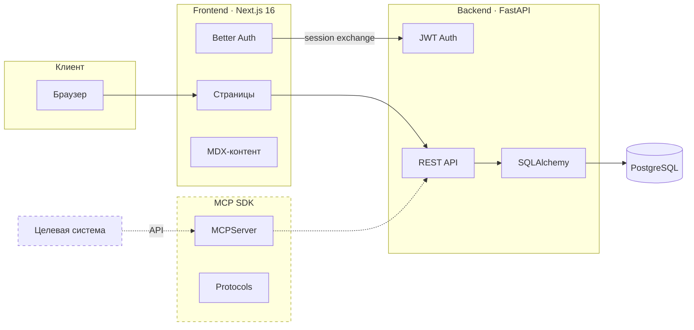
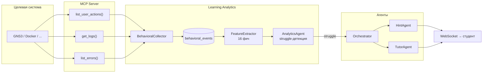

# onlinetlabs (в разработке)

Мультиагентная платформа поддержки обучения сложным программным системам. Монорепо: Next.js, FastAPI, MCP SDK.

## Содержание

- [Архитектура](#архитектура)
- [Технологии](#технологии)
- [Быстрый старт](#быстрый-старт)
- [Make-команды](#make-команды)
- [Структура](#структура)
- [API](#api)
- [MCP SDK](#mcp-sdk)
- [Автотесты](#автотесты)
- [Управление окружением](#управление-окружением)

## Архитектура



> Пунктир — в разработке (WebSocket-сессии, frontend интервенций).

### Learning Analytics: замкнутый цикл реального времени



**Struggle-детекция** (4 типа, все пороги конфигурируемы через `LearningAnalyticsConfig`):

| Тип | Условие | Интервенция |
|-|-|-|
| `REPEATING_ERRORS` | N+ одинаковых ошибок подряд | Hint |
| `TRIAL_AND_ERROR` | Высокая энтропия + частые ошибки | Tutor |
| `IDLE` | Много idle-периодов + замедление | Tutor |
| `STUCK_ON_STEP` | Долго на одном компоненте + idle | Hint |

**Доменная независимость:** при смене целевой системы меняется только MCP-сервер. Коллектор, фичи, аналитика и агенты работают с любой системой через стандартизованные MCP-модели (`UserAction`, `LogEntry`, `ErrorEntry`).

## Технологии

| Frontend | Backend | MCP SDK | Инфра |
|-|-|-|-|
| Next.js 16 | Python 3.11+ | Pydantic 2 | PostgreSQL 16 |
| React 19 | FastAPI | FastMCP | Docker Compose |
| TailwindCSS 4 | SQLAlchemy + Alembic | mcp SDK | Lefthook |
| Fumadocs (MDX) | Pydantic Settings | | |
| Better Auth | Poetry | | |
| shadcn/ui | | | |

## Быстрый старт

Требования: Python 3.11+, Poetry, Node.js 20+, pnpm, Docker.

> **Windows:** если Poetry не найден после установки через pip — добавьте
> `%APPDATA%\Python\Python313\Scripts` в PATH. Для корректного вывода ошибок: `chcp 65001`.

```bash
git clone https://github.com/nevsky118/onlinetlabs.git
cd onlinetlabs
pip install poetry   # если ещё не установлен
make install
```

Настройка окружения — расшифровать конфиги (нужен `CONFIG_PASSWORD`):

```bash
export CONFIG_PASSWORD=...

# backend (путь относительно backend/)
make decrypt file=local.env.aes

# gns3 (оба сервиса)
cd gns3 && make decrypt file=gns3-service/local.env.aes && make decrypt file=gns3-mcp/local.env.aes && cd ..

# autotests
cd autotests && make decrypt file=settings/configuration/local.env.aes && cd ..
```

Запуск:

```bash
make up-db    # PostgreSQL
make migrate  # применить миграции
make serve    # Backend API (hot-reload)
make dev      # Frontend (hot-reload)
```

- Frontend: http://localhost:3000
- Swagger: http://localhost:8000/docs
- pgAdmin: http://localhost:5050

## Docker

Два независимых стека:

**Core** (`deployment/local/compose.yaml`) — backend + DB + Redis:
```bash
make up       # всё (с --wait для healthcheck)
make up-db    # только БД + Redis
make down     # остановить
```

**GNS3 Plugin** (`gns3/docker-compose.yml`) — gns3-server + postgres + gns3-service + gns3-mcp:
```bash
cd gns3
make up       # весь стек
make gns3-up  # только GNS3 сервер
make up-db    # только PostgreSQL
make down     # остановить
```

## Make-команды

| Команда | Описание |
|-|-|
| `make install` | Зависимости (poetry + pnpm) |
| `make serve` | Backend (uvicorn, `ENV=local` по умолчанию) |
| `make serve ENV=prod` | Backend с `prod.env` |
| `make dev` | Frontend (next dev) |
| `make up` / `make down` | Docker core-стек |
| `make up-db` | Только БД + Redis |
| `make logs` / `make ps` | Логи / статус |
| `make psql` | Консоль PostgreSQL |
| `make migrate` | Применить миграции |
| `make migrate-create msg="..."` | Новая миграция |
| `make migrate-rollback` | Откат |
| `make test` | Все тесты (backend + SDK) |
| `make lint` / `make format` | Линтер / форматирование |
| `make check` | Все проверки (CI) |
| `make encrypt file=...` | Шифрование env-файла |
| `make decrypt file=...` | Расшифровка env-файла |
| `make sync-content` | MDX → БД |
| `make clean` | Очистить кэш |

## Структура

```
onlinetlabs/
├── frontend/                    # Next.js 16
│   ├── app/
│   │   ├── (auth)/              # sign-in, sign-up
│   │   ├── (app)/               # courses, labs
│   │   └── api/auth/            # Better Auth route
│   ├── content/                 # MDX (Fumadocs)
│   ├── shared/
│   │   ├── auth/                # Better Auth, JWT, guards
│   │   ├── components/          # навигация, темы
│   │   ├── ui/                  # shadcn/ui
│   │   ├── hooks/
│   │   └── lib/                 # API-клиент
│   ├── entities/user/           # схемы, меню
│   ├── features/auth/           # формы логина
│   └── widgets/                 # header, footer
│
├── backend/                     # FastAPI
│   ├── auth/                    # JWT, OAuth, регистрация/удаление
│   ├── config/                  # Settings, шифрование
│   ├── courses/                 # CRUD
│   ├── labs/                    # CRUD (+ создание/удаление для тестов)
│   ├── progress/                # Прогресс студента
│   ├── sessions/                # Сессии обучения
│   ├── models/                  # ORM (10 таблиц, вкл. behavioral_events)
│   ├── agents/                  # Мультиагентная система
│   │   ├── orchestrator/        # Маршрутизация + проактивные интервенции
│   │   ├── tutor/               # Ответы на вопросы
│   │   ├── hint/                # Прогрессивные подсказки (3 уровня)
│   │   ├── lab/                 # Взаимодействие с лаб-средой через MCP
│   │   ├── validator/           # Проверка выполнения задач
│   │   └── analytics/           # Анализ прогресса + struggle-детекция
│   ├── learning_analytics/      # Замкнутый LA-цикл реального времени
│   │   ├── collector.py         # Опрос MCP, дедупликация, нормализация
│   │   ├── features.py          # 16 поведенческих фич
│   │   └── monitor.py           # Сбор + анализ + интервенция
│   ├── db/                      # Async сессия
│   ├── migrations/              # Alembic
│   ├── Dockerfile               # Docker-образ
│   └── tests/                   # unit/integration/smoke
│
├── gns3/                        # GNS3 плагин (отдельный стек)
│   ├── gns3-service/            # FastAPI — сессии, проекты, история
│   ├── gns3-mcp/                # MCP-сервер для агентов
│   ├── docker-compose.yml       # GNS3 + postgres + service + mcp
│   └── Makefile
│
├── mcp-sdk/                     # MCP SDK
│
├── autotests/                   # API-автотесты (httpx + pytest)
│   ├── conftest.py              # Фикстуры: users, tokens, lab, GNS3 project
│   ├── api/                     # API methods, helpers, data
│   ├── api_tests/               # smoke + crud тесты
│   └── Makefile                 # make test / make test ENV=ci
│
├── deployment/local/            # Docker Compose (core)
│   ├── compose.yaml             # db + pgadmin + backend + redis
│   └── pgadmin/
│
├── Makefile
└── lefthook.yml
```

## API

Swagger UI: http://localhost:8000/docs

## MCP SDK

Фреймворк для MCP-серверов, подключающих сложные системы к ИИ-агентам.

| Протокол | Назначение |
|-|-|
| **StateProvider** | Состояние системы (компоненты, обзор) |
| **LogProvider** | Логи и ошибки |
| **HistoryProvider** | История действий пользователя |
| **ActionProvider** | Выполнение действий |

```python
from onlinetlabs_mcp_sdk import OnlinetlabsMCPServer

class GNS3StateProvider:
    async def list_components(self, ctx): ...
    async def get_component(self, ctx, component_id): ...
    async def get_system_overview(self, ctx): ...

server = OnlinetlabsMCPServer(
    name="gns3",
    providers=[GNS3StateProvider()],
)
```

## Автотесты

20 API-тестов, все сервисы. Автоматическая настройка тестовых данных и очистка.

```bash
cd autotests
make test              # все тесты (ENV=local)
make test ENV=ci       # CI-окружение (Docker-сети)
```

Conftest автоматически:
- Регистрирует тестовых пользователей → генерирует JWT
- Создаёт тестовую лабораторную (`autotest-lab`)
- Создаёт шаблонный проект GNS3
- Удаляет всё после завершения тестов

## Управление окружением

Конфиги хранятся зашифрованными (AES-256-CBC). Расшифрованные файлы не коммитятся.

| Файл | Назначение |
|-|-|
| `*.env.aes` | Зашифрованный конфиг (в git) |
| `*.env` | Расшифрованный (gitignored, не коммитится) |

```bash
# Расшифровка
CONFIG_PASSWORD=... make decrypt file=backend/local.env.aes

# Зашифровать после изменений
CONFIG_PASSWORD=... make encrypt file=backend/local.env
```

Все Makefile поддерживают `ENV=` для выбора окружения:
```bash
make serve              # ENV=local (по умолчанию)
make serve ENV=prod     # prod-окружение
```
