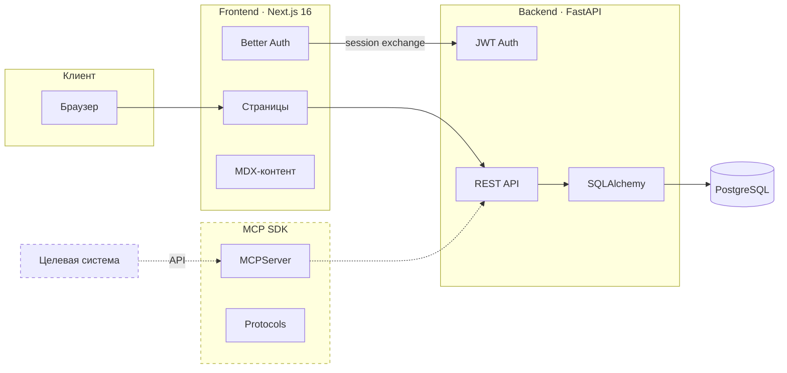

# onlinetlabs (в разработке)

Мультиагентная платформа поддержки обучения сложным программным системам. Монорепо: Next.js, FastAPI, MCP SDK.

## Содержание

- [Архитектура](#архитектура)
- [Технологии](#технологии)
- [Быстрый старт](#быстрый-старт)
- [Make-команды](#make-команды)
- [Структура](#структура)
- [API](#api)
- [MCP SDK](#mcp-sdk)
- [Тесты](#тесты)

## Архитектура



> Пунктир — в разработке (MCP-интеграция, агенты, WebSocket-сессии).

## Технологии

| Frontend | Backend | MCP SDK | Инфра |
|-|-|-|-|
| Next.js 16 | Python 3.11+ | Pydantic 2 | PostgreSQL 16 |
| React 19 | FastAPI | FastMCP | Docker Compose |
| TailwindCSS 4 | SQLAlchemy + Alembic | mcp SDK | Lefthook |
| Fumadocs (MDX) | Pydantic Settings | | |
| Better Auth | Poetry | | |
| shadcn/ui | | | |

## Быстрый старт

Требования: Python 3.11+, Poetry, Node.js 20+, pnpm, Docker.

```bash
git clone https://github.com/nevsky118/onlinetlabs.git
cd onlinetlabs
make install
```

Настройка окружения:

```bash
# Backend
cd onlinetlabs-backend && cp local.env.example local.env
# заполнить DB_*, JWT_SECRET, CLAUDE_API_KEY

# Frontend
cd onlinetlabs-frontend && cp .env.example .env.local
# заполнить BETTER_AUTH_SECRET, GITHUB_CLIENT_ID/SECRET
```

Запуск:

```bash
make up-db    # PostgreSQL + pgAdmin
make serve    # API (hot-reload)
make dev      # Frontend (hot-reload)
```

- Frontend: http://localhost:3000
- Swagger: http://localhost:8000/docs
- pgAdmin: http://localhost:5050

## Make-команды

| Команда | Описание |
|-|-|
| `make install` | Зависимости (poetry + pnpm) |
| `make serve` | Backend (uvicorn) |
| `make dev` | Frontend (next dev) |
| `make up` / `make down` | Docker сервисы |
| `make up-db` | Только БД + pgAdmin |
| `make logs` / `make ps` | Логи / статус |
| `make psql` | Консоль PostgreSQL |
| `make migrate` | Применить миграции |
| `make migrate-create msg="..."` | Новая миграция |
| `make migrate-rollback` | Откат |
| `make test` | Backend тесты (smoke + api + auth) |
| `make test-all` | Все backend тесты |
| `make test-sdk` | MCP SDK тесты |
| `make lint` / `make format` | Линтер / форматирование |
| `make check` | Все проверки (CI) |
| `make encrypt` / `make decrypt` | Шифрование .env |
| `make sync-content` | MDX → БД |
| `make clean` | Очистить кэш |

## Структура

```
onlinetlabs/
├── onlinetlabs-frontend/        # Next.js 16
│   ├── app/
│   │   ├── (auth)/              # sign-in, sign-up
│   │   ├── (app)/               # courses, labs
│   │   └── api/auth/            # Better Auth route
│   ├── content/                 # MDX (Fumadocs)
│   ├── shared/
│   │   ├── auth/                # Better Auth, JWT, guards
│   │   ├── components/          # навигация, темы
│   │   ├── ui/                  # shadcn/ui
│   │   ├── hooks/
│   │   └── lib/                 # API-клиент
│   ├── entities/user/           # схемы, меню
│   ├── features/auth/           # формы логина
│   └── widgets/                 # header, footer
│
├── onlinetlabs-backend/         # FastAPI
│   ├── auth/                    # JWT, OAuth
│   ├── config/                  # Settings, шифрование
│   ├── courses/                 # CRUD
│   ├── labs/                    # CRUD
│   ├── progress/                # Прогресс студента
│   ├── sessions/                # Сессии обучения
│   ├── models/                  # ORM (9 таблиц)
│   ├── db/                      # Async сессия
│   ├── migrations/              # Alembic
│   └── tests/                   # unit/integration/smoke
│
├── onlinetlabs-mcp-sdk/         # MCP SDK
│   ├── src/onlinetlabs_mcp_sdk/
│   │   ├── server.py            # MCPServer
│   │   ├── protocols.py         # State/Log/History/Action
│   │   ├── models.py            # Pydantic-модели
│   │   ├── connection.py        # ConnectionPool
│   │   ├── context.py           # SessionContext
│   │   ├── errors.py            # Ошибки
│   │   └── testing/             # ConformanceTestSuite
│   └── tests/                   # unit/integration/smoke
│
├── deployment/local/            # Docker Compose
├── scripts/                     # sync_content
├── Makefile
└── lefthook.yml
```

## API

Swagger UI: http://localhost:8000/docs

## MCP SDK

Фреймворк для MCP-серверов, подключающих сложные системы к ИИ-агентам.

| Протокол | Назначение |
|-|-|
| **StateProvider** | Состояние системы (компоненты, обзор) |
| **LogProvider** | Логи и ошибки |
| **HistoryProvider** | История действий пользователя |
| **ActionProvider** | Выполнение действий |

```python
from onlinetlabs_mcp_sdk import OnlinetlabsMCPServer

class GNS3StateProvider:
    async def list_components(self, ctx): ...
    async def get_component(self, ctx, component_id): ...
    async def get_system_overview(self, ctx): ...

server = OnlinetlabsMCPServer(
    name="gns3",
    providers=[GNS3StateProvider()],
)
```

Валидация реализаций через `ConformanceTestSuite`:

```python
from onlinetlabs_mcp_sdk.testing import ConformanceTestSuite

class TestGNS3(ConformanceTestSuite):
    provider_class = GNS3StateProvider
```

## Тесты

```bash
make test        # smoke + api + auth
make test-all    # все
make test-sdk    # MCP SDK
make check       # lint + typecheck
```

Маркеры: `smoke`, `api`, `auth`, `unit`, `integration`. Backend тесты на SQLite in-memory, PostgreSQL не нужен.
