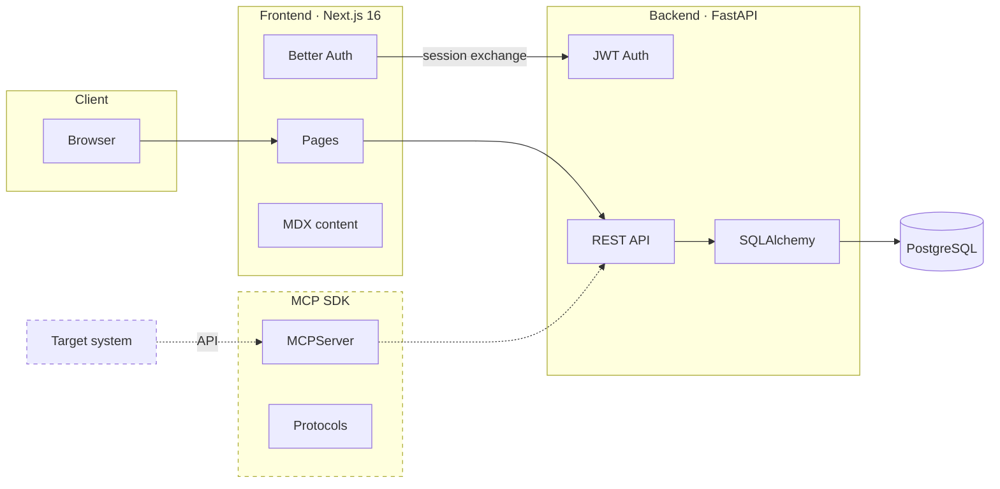
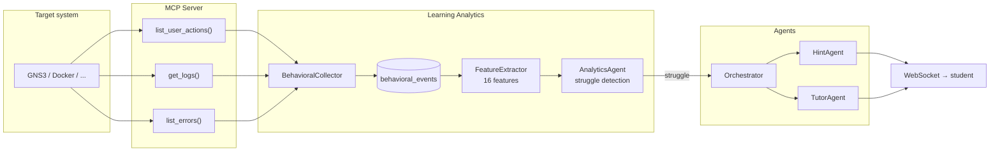

# onlinetlabs (work in progress)

Multiagent platform for supporting learning of complex software systems. Monorepo: Next.js, FastAPI, MCP SDK.

## Contents

- [Architecture](#architecture)
- [Technologies](#technologies)
- [Quick start](#quick-start)
- [Make commands](#make-commands)
- [Structure](#structure)
- [API](#api)
- [MCP SDK](#mcp-sdk)
- [Autotests](#autotests)
- [Environment management](#environment-management)

## Architecture


```mermaid
flowchart LR
    subgraph Client["Client"]
        Browser["Browser"]
    end

    subgraph FE["Frontend · Next.js 16"]
        Pages["Pages"]
        AuthFE["Better Auth"]
        MDX["MDX content"]
    end

    subgraph BE["Backend · FastAPI"]
        AuthBE["JWT Auth"]
        API["REST API"]
        ORM["SQLAlchemy"]
    end

    subgraph SDK["MCP SDK"]
        Server["MCPServer"]
        Proto["Protocols"]
    end

    DB[(PostgreSQL)]
    Target["Target system"]

    Browser --> Pages
    Pages --> API
    AuthFE -->|session exchange| AuthBE
    API --> ORM --> DB
    Server -.-> API
    Target -.->|API| Server

    style SDK stroke-dasharray: 5 5
    style Target stroke-dasharray: 5 5
```

> Dashed lines mark what is still in development (WebSocket sessions, intervention frontend).

### Learning Analytics: a real-time closed loop


```mermaid
flowchart LR
    subgraph Target["Target system"]
        GNS3["GNS3 / Docker / ..."]
    end

    subgraph MCP["MCP Server"]
        Actions["list_user_actions()"]
        Logs["get_logs()"]
        Errors["list_errors()"]
    end

    subgraph LA["Learning Analytics"]
        Collector["BehavioralCollector"]
        DB[("behavioral_events")]
        Features["FeatureExtractor<br/>16 features"]
        Analytics["AnalyticsAgent<br/>struggle detection"]
    end

    subgraph Agents["Agents"]
        Orch["Orchestrator"]
        Hint["HintAgent"]
        Tutor["TutorAgent"]
    end

    WS["WebSocket → student"]

    GNS3 --> Actions & Logs & Errors
    Actions & Logs & Errors --> Collector
    Collector --> DB
    DB --> Features
    Features --> Analytics
    Analytics -->|struggle| Orch
    Orch --> Hint & Tutor
    Hint & Tutor --> WS
```

**Struggle detection** (4 types, all thresholds configurable through `LearningAnalyticsConfig`):

| Type | Condition | Intervention |
|-|-|-|
| `REPEATING_ERRORS` | N+ identical errors in a row | Hint |
| `TRIAL_AND_ERROR` | High entropy + frequent errors | Tutor |
| `IDLE` | Many idle periods + slowdown | Tutor |
| `STUCK_ON_STEP` | Long time on one component + idle | Hint |

**Domain independence:** when the target system changes, only the MCP server changes. The collector, features, analytics and agents work with any system through the standardized MCP models (`UserAction`, `LogEntry`, `ErrorEntry`).

## Technologies

| Frontend | Backend | MCP SDK | Infra |
|-|-|-|-|
| Next.js 16 | Python 3.11+ | Pydantic 2 | PostgreSQL 16 |
| React 19 | FastAPI | FastMCP | Docker Compose |
| TailwindCSS 4 | SQLAlchemy + Alembic | mcp SDK | Lefthook |
| Fumadocs (MDX) | Pydantic Settings | | Redis |
| Better Auth | Poetry | | |
| shadcn/ui | | | |

## Quick start

Requirements: Python 3.11+, Poetry, Node.js 20+, pnpm, Docker.

> **Windows:** if Poetry is not found after installing it through pip, add
> `%APPDATA%\Python\Python313\Scripts` to PATH. For correct error output, run `chcp 65001`.

```bash
git clone https://github.com/nevsky118/onlinetlabs.git
cd onlinetlabs
pip install poetry   # if not installed yet
make install
```

Environment setup, decrypt the configs (`CONFIG_PASSWORD` is required):

```bash
export CONFIG_PASSWORD=...

# whole stack, all env files live in deployment/<tier>/ (local, development, ci)
make decrypt

# gns3 is a separate service, encrypted separately
cd gns3 && make decrypt && cd ..
```

Running:

```bash
make up-db    # PostgreSQL
make migrate  # apply migrations
make serve    # Backend API (hot-reload)
make dev      # Frontend (hot-reload)
```

- Frontend: http://localhost:3000
- Swagger: http://localhost:8000/docs
- pgAdmin: http://localhost:5050

## Docker

Two independent stacks:

**Core** (`deployment/local/compose.yaml`), frontend + backend + DB + Redis + pgAdmin:
```bash
make up       # everything (with --wait for the healthcheck)
make up-db    # database + Redis only
make down     # stop
```

**GNS3 Plugin** (`gns3/docker-compose.yml`), gns3-server + postgres + gns3-service + gns3-mcp (an isolated stack, launched from `gns3/`; pgbouncer exists only in the prod overlay):
```bash
cd gns3
make decrypt  # its own .env.aes files
make up       # whole stack + build of the role images (frr-role/dhcp-role)
make down     # stop
```

## Make commands

| Command | Description |
|-|-|
| `make install` | Dependencies (poetry + pnpm) |
| `make serve` | Backend (uvicorn, `ENV=local` by default) |
| `make serve ENV=development` | Backend with the development config |
| `make dev` | Frontend (next dev) |
| `make up` / `make down` | Docker core stack |
| `make up-db` | Database + Redis only |
| `make logs` / `make ps` | Logs / status |
| `make psql` | PostgreSQL console |
| `make migrate` | Apply migrations |
| `make migrate-create msg="..."` | New migration |
| `make migrate-rollback` | Rollback |
| `make test` | All tests (backend + SDK) |
| `make lint` / `make format` | Linter / formatting |
| `make check` | All checks (CI) |
| `make encrypt` / `make decrypt` | Encrypt / decrypt every env file in deployment/ |
| `make sync-content` | MDX → DB |
| `make clean` | Clear the cache |

## Structure

```
onlinetlabs/
├── frontend/                    # Next.js 16
│   ├── app/                     # routes (thin shells)
│   │   ├── (auth)/              # sign-in, sign-up
│   │   ├── (app)/               # courses, labs, session
│   │   └── api/                 # Better Auth + BFF route handlers
│   ├── modules/                 # features (Cal.com-style): auth, session
│   ├── auth/                    # Better Auth config, guards, session, JWT
│   ├── content/                 # MDX (Fumadocs)
│   ├── shared/                  # ui (shadcn), components, hooks, lib
│   └── styles/
│
├── backend/                     # FastAPI
│   ├── auth/                    # JWT, OAuth, registration/deletion
│   ├── config/                  # Settings, env loading
│   ├── courses/                 # CRUD
│   ├── labs/                    # CRUD (+ create/delete for tests)
│   ├── progress/                # Student progress
│   ├── sessions/                # Learning sessions
│   ├── chat/                    # Tutor dialogue history
│   ├── models/                  # ORM (incl. behavioral_events, platform_events)
│   ├── agents/                  # Multiagent system
│   │   ├── orchestrator/        # Routing + proactive interventions
│   │   ├── tutor/               # Answers to questions
│   │   ├── hint/                # Progressive hints (3 levels)
│   │   ├── lab/                 # Interaction with the lab environment through MCP
│   │   ├── validator/           # Checking task completion
│   │   └── analytics/           # Progress analysis + struggle detection
│   ├── learning_analytics/      # Real-time closed LA loop
│   │   ├── collector.py         # MCP polling, deduplication, normalization
│   │   ├── features.py          # 16 behavioral features
│   │   └── monitor.py           # Collection + analysis + intervention
│   ├── db/                      # Async session
│   ├── migrations/              # Alembic
│   ├── Dockerfile               # Docker image
│   └── tests/                   # unit/integration/smoke
│
├── gns3/                        # GNS3 plugin (separate stack)
│   ├── gns3-service/            # FastAPI, sessions, projects, history
│   ├── gns3-mcp/                # MCP server for the agents
│   ├── docker-compose.yml       # GNS3 + postgres + service + mcp (pgbouncer in the prod overlay)
│   └── Makefile
│
├── mcp-sdk/                     # MCP SDK
│
├── autotests/                   # API autotests (httpx + pytest)
│   ├── conftest.py              # Fixtures: users, tokens, lab, GNS3 project
│   ├── api/                     # API methods, helpers, data
│   ├── api_tests/               # smoke / crud / e2e tests
│   └── Makefile                 # make test / make test ENV=ci
│
├── deployment/                  # environments by tier (env + compose)
│   ├── local/                   # compose.yaml (core stack) + *.env.aes
│   ├── development/             # *.env.aes
│   └── ci/                      # autotests.env.aes
│
├── Makefile
└── lefthook.yml
```

## API

Swagger UI: http://localhost:8000/docs

## MCP SDK

A framework for MCP servers that connect complex systems to AI agents.

| Protocol | Purpose |
|-|-|
| **StateProvider** | System state (components, overview) |
| **LogProvider** | Logs and errors |
| **HistoryProvider** | User action history |
| **ActionProvider** | Action execution |

```python
from mcp_sdk import OnlinetlabsMCPServer

class GNS3Implementation:
    async def list_components(self, ctx): ...
    async def get_component(self, ctx, component_id): ...
    async def get_system_overview(self, ctx): ...

server = OnlinetlabsMCPServer(
    name="gns3",
    implementation=GNS3Implementation(),
)
```

## Autotests

API tests (smoke / crud / e2e) for every service. Test data setup and cleanup are automatic.

```bash
cd autotests
make test              # all tests (ENV=local)
make test ENV=ci       # CI environment (Docker networks)
```

Conftest automatically:
- Registers test users → generates JWT
- Creates a test lab (`autotest-lab`)
- Creates a GNS3 template project
- Deletes everything once the tests finish

## Environment management

Configs are kept encrypted (AES-256-CBC). Decrypted files are never committed.

| File | Purpose |
|-|-|
| `*.env.aes` | Encrypted config (in git) |
| `*.env` | Decrypted (gitignored, not committed) |

```bash
# Decrypt every env file (deployment/<tier>/*.env)
CONFIG_PASSWORD=... make decrypt

# Encrypt after making changes
CONFIG_PASSWORD=... make encrypt
```

Environments are tiers under `deployment/<tier>/` (`local`, `development`, `ci`), selected with `ENV=`:
```bash
make serve                  # ENV=local → deployment/local/backend.env
make serve ENV=development  # deployment/development/backend.env
```
