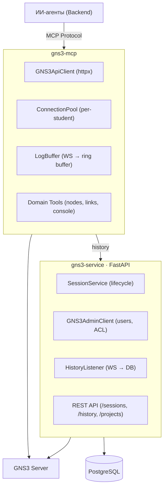

# gns3

GNS3 интеграция: MCP-сервер для ИИ-агентов + сервис управления сессиями студентов.

## Архитектура



## Технологии

| gns3-mcp | gns3-service | Инфра |
|-|-|-|
| mcp-sdk | FastAPI | PostgreSQL 16 |
| httpx | SQLAlchemy 2 (async) | Docker Compose |
| websockets | Alembic | GNS3 3.0 |
| Pydantic 2 | asyncpg | |

## Быстрый старт

```bash
make install

# Расшифровать конфиги (нужен CONFIG_PASSWORD)
CONFIG_PASSWORD=... make decrypt file=gns3-service/local.env.aes
CONFIG_PASSWORD=... make decrypt file=gns3-mcp/local.env.aes

# Docker (GNS3 + PostgreSQL + gns3-service + gns3-mcp)
make up

# Локальная разработка (deps в Docker, сервисы на хосте)
make up-db && make gns3-up
make serve         # gns3-service (uvicorn + hot reload)
make serve-mcp     # gns3-mcp
```

## Docker

`docker-compose.yml` в корне `gns3/` — полный стек плагина:

| Сервис | Порт | Описание |
|-|-|-|
| gns3-server | 3080 | GNS3 сервер |
| postgres | 5433 | БД для gns3-service |
| gns3-service | 8101 | FastAPI REST API |
| gns3-mcp | 8100 | MCP-сервер |

```bash
make up       # весь стек
make gns3-up  # только GNS3 сервер
make up-db    # только PostgreSQL
make down     # остановить
```

## Make-команды

| Команда | Описание |
|-|-|
| `make install` | Зависимости (poetry) |
| `make serve` | gns3-service (`ENV=local` по умолчанию) |
| `make serve-mcp` | MCP-сервер |
| `make up` / `make down` | Docker стек |
| `make gns3-up` | Только GNS3 сервер |
| `make up-db` | Только PostgreSQL |
| `make psql` | Консоль PostgreSQL |
| `make test` | Тесты gns3-mcp |
| `make lint` | Ruff линтер |
| `make migrate` | Применить миграции |
| `make migrate-create msg="..."` | Новая миграция |
| `make encrypt file=...` | Шифрование env |
| `make decrypt file=...` | Расшифровка env |
| `make clean` | Очистить кэш |

## Структура

```
gns3/
├── docker-compose.yml            # Полный стек (GNS3 + PG + service + mcp)
├── Makefile
│
├── gns3-mcp/                     # MCP-сервер для GNS3
│   ├── src/
│   │   ├── api_client.py         # httpx клиент GNS3 v3 API
│   │   ├── server.py             # StateProvider, LogProvider, etc.
│   │   ├── domain_tools.py       # MCP tools (start/stop, links, console)
│   │   ├── connection.py         # ConnectionPool + manager
│   │   ├── log_buffer.py         # WS → ring buffer
│   │   ├── mappers.py            # GNS3 → SDK модели
│   │   ├── config/               # EnvConfigLoader
│   │   └── main.py               # Entry point
│   ├── Dockerfile                # Docker-образ
│   ├── local.env.aes             # Зашифрованный конфиг
│   └── tests/
│
├── gns3-service/                  # Сервис сессий студентов
│   ├── src/
│   │   ├── service.py            # SessionService (lifecycle)
│   │   ├── gns3_admin_client.py  # Users, roles, ACL, projects
│   │   ├── history.py            # WS listener → PostgreSQL
│   │   ├── router.py             # REST endpoints
│   │   ├── models.py             # Pydantic schemas
│   │   ├── db/                   # SQLAlchemy models + session
│   │   ├── config/               # EnvConfigLoader
│   │   └── main.py               # FastAPI app + entry point
│   ├── Dockerfile                # GNS3 server image (gns3-server 3.0.6)
│   ├── Dockerfile.service        # FastAPI service image
│   ├── alembic/                  # Миграции
│   ├── local.env.aes             # Зашифрованный конфиг
│   └── tests/
```

## API (gns3-service)

| Метод | Endpoint | Описание |
|-|-|-|
| GET | `/health` | Health check |
| POST | `/sessions` | Создать сессию (user + project + ACL) |
| GET | `/sessions/{id}` | Статус сессии |
| POST | `/sessions/{id}/reset-password` | Сброс пароля GNS3 |
| DELETE | `/sessions/{id}` | Удалить (cleanup user + project) |
| GET | `/history/{id}/actions` | История событий |
| POST | `/projects` | Создать проект в GNS3 |
| GET | `/projects` | Список проектов |
| DELETE | `/projects/{id}` | Удалить проект |

## MCP Tools

| Tool | Описание |
|-|-|
| `start_node` / `stop_node` | Запуск/остановка ноды |
| `start_all` / `stop_all` | Все ноды проекта |
| `create_link` / `delete_link` | Связи между нодами |
| `get_console_info` | Telnet/VNC доступ |
| `list_templates` | Доступные шаблоны |
| `create_node_from_template` | Нода из шаблона |
| `create_snapshot` | Снапшот проекта |

## Управление окружением

Конфиги зашифрованы (AES-256-CBC). В git хранятся только `.aes` файлы.

```bash
# Расшифровать
CONFIG_PASSWORD=... make decrypt file=gns3-service/local.env.aes

# Зашифровать после изменений
CONFIG_PASSWORD=... make encrypt file=gns3-service/local.env
```

Все Make-команды поддерживают `ENV=`:
```bash
make serve              # ENV=local (по умолчанию)
make serve ENV=prod     # prod-окружение
```
