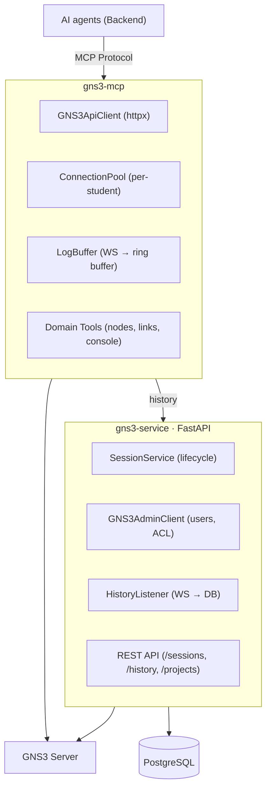

# gns3

GNS3 integration. An MCP server for AI agents plus a service that manages student sessions.

## Architecture


```mermaid
flowchart TB
    Agents["AI agents (Backend)"]

    subgraph MCP["gns3-mcp"]
        ApiClient["GNS3ApiClient (httpx)"]
        Pool["ConnectionPool (per-student)"]
        LogBuf["LogBuffer (WS → ring buffer)"]
        Tools["Domain Tools (nodes, links, console)"]
    end

    subgraph SVC["gns3-service · FastAPI"]
        Session["SessionService (lifecycle)"]
        Admin["GNS3AdminClient (users, ACL)"]
        History["HistoryListener (WS → DB)"]
        API["REST API (/sessions, /history, /projects)"]
    end

    DB[(PostgreSQL)]
    GNS3["GNS3 Server"]

    Agents -->|MCP Protocol| MCP
    MCP --> GNS3
    MCP -->|history| SVC
    SVC --> GNS3
    SVC --> DB
```

## Technologies

| gns3-mcp | gns3-service | Infra |
|-|-|-|
| mcp-sdk | FastAPI | PostgreSQL 16 |
| httpx | SQLAlchemy 2 (async) | Docker Compose |
| websockets | Alembic | GNS3 3.0 |
| Pydantic 2 | asyncpg | |

## Quick start

```bash
make install

# Decrypt all gns3 configs at once (CONFIG_PASSWORD is required)
CONFIG_PASSWORD=... make decrypt

# Docker (GNS3 + PostgreSQL + gns3-service + gns3-mcp), role images are built automatically
make up

# Local development (deps in Docker, services on the host)
make up-db && make gns3-up
make serve         # gns3-service (uvicorn + hot reload)
make serve-mcp     # gns3-mcp
```

## Docker

`docker-compose.yml` in the root of `gns3/` holds the full plugin stack:

| Service | Port | Description |
|-|-|-|
| gns3-server | 3080 | GNS3 server |
| postgres | 5433 | Database for gns3-service |
| gns3-service | 8101 | FastAPI REST API |
| gns3-mcp | 8100 | MCP server |

```bash
make up       # whole stack + build of the role images (frr-role/dhcp-role)
make gns3-up  # GNS3 server only
make up-db    # PostgreSQL only
make down     # stop
```

## Make commands

| Command | Description |
|-|-|
| `make install` | Dependencies (poetry) |
| `make serve` | gns3-service (`ENV=local` by default) |
| `make serve-mcp` | MCP server |
| `make up` / `make down` | Docker stack |
| `make gns3-up` | GNS3 server only |
| `make up-db` | PostgreSQL only |
| `make psql` | PostgreSQL console |
| `make test` | gns3-mcp tests |
| `make lint` | Ruff linter |
| `make migrate` | Apply migrations |
| `make migrate-create msg="..."` | New migration |
| `make encrypt file=...` | Encrypt an env file |
| `make decrypt file=...` | Decrypt an env file |
| `make clean` | Clear the cache |

## Structure

```
gns3/
├── docker-compose.yml            # Full stack (GNS3 + PG + service + mcp)
├── Makefile
│
├── gns3-mcp/                     # MCP server for GNS3
│   ├── src/
│   │   ├── api_client.py         # httpx client for the GNS3 v3 API
│   │   ├── server.py             # StateProvider, LogProvider, etc.
│   │   ├── domain_tools.py       # MCP tools (start/stop, links, console)
│   │   ├── connection.py         # ConnectionPool + manager
│   │   ├── log_buffer.py         # WS → ring buffer
│   │   ├── mappers.py            # GNS3 → SDK models
│   │   ├── config/               # EnvConfigLoader
│   │   └── main.py               # Entry point
│   ├── Dockerfile                # Docker image
│   ├── local.env.aes             # Encrypted config
│   └── tests/
│
├── gns3-service/                  # Student session service
│   ├── src/
│   │   ├── service.py            # SessionService (lifecycle)
│   │   ├── gns3_admin_client.py  # Users, roles, ACL, projects
│   │   ├── history.py            # WS listener → PostgreSQL
│   │   ├── router.py             # REST endpoints
│   │   ├── models.py             # Pydantic schemas
│   │   ├── db/                   # SQLAlchemy models + session
│   │   ├── config/               # EnvConfigLoader
│   │   └── main.py               # FastAPI app + entry point
│   ├── Dockerfile                # GNS3 server image (gns3-server 3.0.6)
│   ├── Dockerfile.service        # FastAPI service image
│   ├── alembic/                  # Migrations
│   ├── local.env.aes             # Encrypted config
│   └── tests/
```

## API (gns3-service)

| Method | Endpoint | Description |
|-|-|-|
| GET | `/health` | Health check |
| POST | `/sessions` | Create a session (user + project + ACL) |
| GET | `/sessions/{id}` | Session status |
| POST | `/sessions/{id}/reset-password` | Reset the GNS3 password |
| DELETE | `/sessions/{id}` | Delete (cleanup user + project) |
| GET | `/history/{id}/actions` | Event history |
| POST | `/projects` | Create a project in GNS3 |
| GET | `/projects` | List of projects |
| DELETE | `/projects/{id}` | Delete a project |

## MCP Tools

| Tool | Description |
|-|-|
| `start_node` / `stop_node` | Start/stop a node |
| `start_all` / `stop_all` | All nodes of the project |
| `create_link` / `delete_link` | Links between nodes |
| `get_console_info` | Telnet/VNC access |
| `list_templates` | Available templates |
| `create_node_from_template` | A node from a template |
| `create_snapshot` | Project snapshot |

## Environment management

Configs are encrypted (AES-256-CBC). Only `.aes` files are stored in git.

```bash
# Decrypt
CONFIG_PASSWORD=... make decrypt file=gns3-service/local.env.aes

# Encrypt after making changes
CONFIG_PASSWORD=... make encrypt file=gns3-service/local.env
```

All Make commands support `ENV=`:
```bash
make serve              # ENV=local (default)
make serve ENV=prod     # prod environment
```
