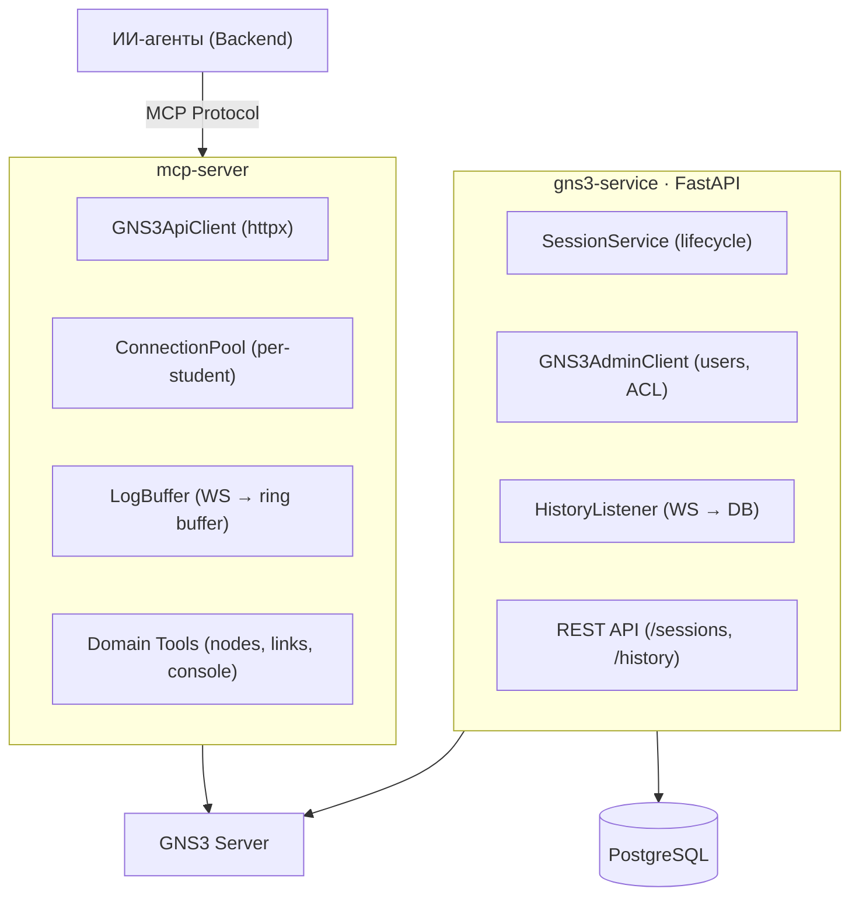

# onlinetlabs-gns3

GNS3 интеграция: MCP-сервер для ИИ-агентов + сервис управления сессиями студентов.

## Архитектура



## Технологии

| mcp-server | gns3-service | Инфра |
|-|-|-|
| onlinetlabs-mcp-sdk | FastAPI | PostgreSQL 16 |
| httpx | SQLAlchemy 2 (async) | Docker Compose |
| websockets | Alembic | GNS3 3.0 |
| Pydantic 2 | asyncpg | |

## Быстрый старт

```bash
# Зависимости
make install

# Запуск GNS3 + PostgreSQL (тестовые)
make gns3-up

# Тесты
make test          # unit + integration
make test-e2e      # e2e (требует gns3-up)

# Запуск
make serve         # gns3-service (uvicorn + hot reload)
make serve-mcp     # mcp-server
```

Настройка окружения:

```bash
cd mcp-server && cp .env.example .env
cd gns3-service && cp .env.example .env
# заполнить переменные
```

## Make-команды

| Команда | Описание |
|-|-|
| `make install` | Зависимости (poetry) |
| `make serve` | gns3-service (uvicorn + hot reload) |
| `make serve-mcp` | MCP-сервер |
| `make test` | Тесты обоих сервисов |
| `make test-mcp` | Тесты mcp-server |
| `make test-service` | Тесты gns3-service |
| `make test-e2e` | E2E (GNS3 + PostgreSQL) |
| `make lint` | Ruff линтер |
| `make gns3-up` / `gns3-down` | Docker окружение |
| `make clean` | Очистить кэш |

## Структура

```
onlinetlabs-gns3/
├── mcp-server/                  # MCP-сервер для GNS3
│   ├── src/
│   │   ├── api_client.py        # httpx клиент GNS3 v3 API
│   │   ├── server.py            # StateProvider, LogProvider, etc.
│   │   ├── domain_tools.py      # MCP tools (start/stop, links, console)
│   │   ├── connection.py        # ConnectionPool + manager
│   │   ├── log_buffer.py        # WS → ring buffer
│   │   ├── mappers.py           # GNS3 → SDK модели
│   │   ├── config/              # EnvConfigLoader
│   │   └── main.py              # Entry point
│   └── tests/                   # smoke/unit/integration/e2e
│
├── gns3-service/                # Сервис сессий студентов
│   ├── src/
│   │   ├── service.py           # SessionService (lifecycle)
│   │   ├── gns3_admin_client.py # Users, roles, ACL, projects
│   │   ├── history.py           # WS listener → PostgreSQL
│   │   ├── router.py            # REST endpoints
│   │   ├── db/                  # SQLAlchemy models + session
│   │   ├── config/              # EnvConfigLoader
│   │   └── main.py              # FastAPI app + entry point
│   ├── alembic/                 # Миграции
│   └── tests/                   # smoke/unit/integration/e2e
│
├── docker-compose.test.yml      # GNS3 + PostgreSQL
└── Makefile
```

## MCP Tools

| Tool | Описание |
|-|-|
| `start_node` / `stop_node` | Запуск/остановка ноды |
| `start_all` / `stop_all` | Все ноды проекта |
| `create_link` / `delete_link` | Связи между нодами |
| `get_console_info` | Telnet/VNC доступ |
| `list_templates` | Доступные шаблоны |
| `create_node_from_template` | Нода из шаблона |
| `create_snapshot` | Снапшот проекта |

## API (gns3-service)

| Метод | Endpoint | Описание |
|-|-|-|
| POST | `/sessions` | Создать сессию (user + project + ACL) |
| GET | `/sessions/{id}` | Статус сессии |
| POST | `/sessions/{id}/reset-password` | Сброс пароля GNS3 (новый пароль + JWT) |
| DELETE | `/sessions/{id}` | Удалить (cleanup GNS3 user) |
| GET | `/history/{id}/actions` | История событий |

## Тесты

```bash
make test       # 86 тестов (59 mcp + 27 service)
make test-e2e   # e2e с реальным GNS3
make lint       # ruff
```

Маркеры: `smoke`, `unit`, `integration`, `e2e`.
